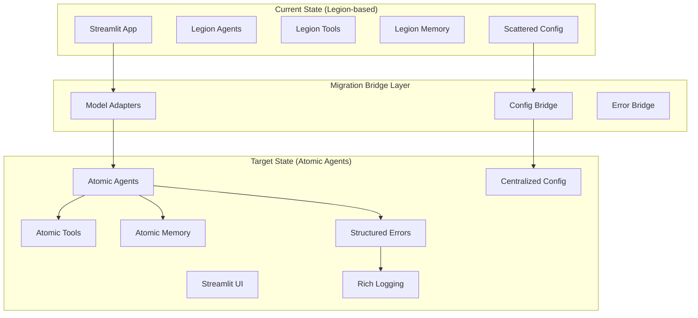

# System Patterns

This document describes the overall architecture of the system, key technical decisions, design patterns in use, and critical component relationships for the Legion to Atomic Agents migration.

## 1. System Architecture Overview

The LL-AI system is undergoing a strategic migration from a Legion-based monolithic architecture to a modular, provider-agnostic Atomic Agents architecture using the Strangler Fig pattern.



### 1.1. Key Components & Responsibilities

**Current Architecture (Legion-based):**
- **Streamlit App:** User interface and application orchestration
- **Legion Agents:** AI agents using decorator-based configuration
- **Legion Tools:** Utility functions with inconsistent patterns
- **Legion Memory:** Simple state management
- **Scattered Configuration:** Environment variables and decorator parameters

**Target Architecture (Atomic Agents):**
- **Atomic Agents:** Class-based agents with explicit configuration and provider abstraction
- **BaseIOSchema Models:** Strongly-typed data models with validation
- **Centralized Configuration:** Hierarchical configuration system using BaseIOSchema
- **Structured Error Handling:** BaseIOSchema-based error reporting with context
- **Rich Logging Infrastructure:** Configuration-driven logging with structured output
- **Bridge Adapters:** Compatibility layer enabling gradual migration

**Migration Infrastructure:**
- **Model Adapters:** Convert between Legion and Atomic Agents data formats
- **Configuration Bridge:** Maps legacy config patterns to centralized system
- **Error Bridge:** Translates legacy errors to structured format

### 1.2. Data Flow

**Legacy Data Flow:**
```
User Input → Streamlit → Legion Agent → Legion Tool → Raw Response → Manual Error Handling → User
```

**Target Data Flow:**
```
User Input → Streamlit → Atomic Agent → Validated Input Schema → LLM Provider → 
Validated Output Schema → Structured Error Handling → Rich Logging → User
```

**Migration Data Flow (Current):**
```
User Input → Streamlit → Bridge Adapter → Atomic Agent → BaseIOSchema Validation → 
Provider-Agnostic LLM → Structured Response → Error Schema → Rich Logging → User
```

## 2. Key Technical Decisions & Rationale

### 2.1. Framework Migration: Legion → Atomic Agents
**Decision:** Migrate from custom Legion framework to Atomic Agents
**Rationale:** 
- Provider-agnostic architecture reduces vendor lock-in
- Better testing capabilities with mock providers
- Structured validation with BaseIOSchema improves reliability
- Active community and documentation support
- Async-first design improves performance

### 2.2. Migration Strategy: Strangler Fig Pattern
**Decision:** Use Strangler Fig pattern with bridge adapters
**Rationale:**
- Enables gradual migration without system downtime
- Reduces risk by allowing rollback at any stage
- Maintains functional parity during transition
- Allows parallel development of new and legacy features

### 2.3. Data Modeling: Pydantic → BaseIOSchema
**Decision:** Migrate all data models to BaseIOSchema
**Rationale:**
- Enhanced validation with better error messages
- Improved documentation through required field descriptions
- Better integration with Atomic Agents ecosystem
- Structured serialization for logging and debugging

### 2.4. Configuration Management: Centralized BaseIOSchema
**Decision:** Replace scattered configuration with centralized system
**Rationale:**
- Single source of truth for all configuration
- Type-safe configuration with validation
- Environment-specific overrides with clear hierarchy
- Better debugging and troubleshooting capabilities

### 2.5. Error Handling: Structured BaseIOSchema Errors
**Decision:** Implement structured error handling using BaseIOSchema
**Rationale:**
- Consistent error format across all components
- Better debugging with structured context information
- User-friendly error messages separate from technical details
- Serializable errors for logging and monitoring

## 3. Design Patterns in Use

### 3.1. Strangler Fig Pattern
**Context/Usage:** Overall migration strategy
- **Implementation:** Bridge adapters gradually replace Legion components
- **Benefits:** Risk mitigation, continuous delivery, rollback capability
- **Location:** `llai/bridge/model_adapters.py`

### 3.2. Adapter Pattern
**Context/Usage:** Data model compatibility during migration
- **Implementation:** Convert between Legion and Atomic Agents data formats
- **Benefits:** Maintains compatibility while enabling new architecture
- **Location:** `llai/bridge/model_adapters.py`

### 3.3. Factory Pattern
**Context/Usage:** Configuration object creation
- **Implementation:** `get_config()` function creates appropriate configuration instances
- **Benefits:** Centralized configuration instantiation with environment-specific logic
- **Location:** `llai/config/settings.py`

### 3.4. Strategy Pattern
**Context/Usage:** LLM provider abstraction in Atomic Agents
- **Implementation:** Different LLM providers implement common interface
- **Benefits:** Provider-agnostic agent implementation
- **Location:** Atomic Agents framework (external)

### 3.5. Template Method Pattern
**Context/Usage:** Structured error handling
- **Implementation:** Base error schema with specialized error types
- **Benefits:** Consistent error structure with type-specific details
- **Location:** `llai/utils/exceptions_atomic.py`

### 3.6. Observer Pattern (Planned)
**Context/Usage:** Logging and monitoring integration
- **Implementation:** Structured logging with configurable handlers
- **Benefits:** Flexible logging output without tight coupling
- **Location:** `llai/utils/logging_setup.py`

## 4. Critical Implementation Paths

### 4.1. Agent Execution Flow
**Path:** User Request → Agent Processing → LLM Interaction → Response Validation
**Criticality:** Core business logic
**Key Components:**
- Input validation using BaseIOSchema
- Provider-agnostic LLM calls
- Output validation and error handling
- Structured logging throughout

### 4.2. Error Propagation Flow
**Path:** Error Detection → Context Capture → Structured Error Creation → User Notification
**Criticality:** System reliability and debugging
**Key Components:**
- Atomic error detection at all levels
- Context preservation with timestamps
- User-friendly message generation
- Structured logging for debugging

### 4.3. Configuration Loading Flow
**Path:** Environment Detection → Config File Loading → Validation → Application Setup
**Criticality:** System initialization and runtime behavior
**Key Components:**
- Environment-specific configuration loading
- BaseIOSchema validation of all config values
- Graceful fallback to defaults
- Configuration change detection

### 4.4. Data Model Migration Flow
**Path:** Legacy Data → Bridge Adapter → BaseIOSchema Validation → Atomic Agent Processing
**Criticality:** Data integrity during migration
**Key Components:**
- Lossless data transformation
- Validation at transformation boundaries
- Error handling for malformed legacy data
- Audit logging for migration tracking

## 5. Integration Points

### 5.1. External LLM Providers
**Integration:** Atomic Agents provider abstraction
**Protocols:** HTTP/REST APIs with provider-specific authentication
**Data Format:** JSON with BaseIOSchema validation
**Error Handling:** Provider-specific error mapping to structured errors

### 5.2. Streamlit UI Framework
**Integration:** Direct Python integration with agent classes
**Data Exchange:** BaseIOSchema models for type safety
**Error Handling:** Structured error display with user-friendly messages
**State Management:** Streamlit session state with BaseIOSchema validation

### 5.3. File System & Resources
**Integration:** Direct file system access for templates and taxonomies
**Data Format:** Markdown templates, text files for taxonomies
**Validation:** Content validation using BaseIOSchema where applicable
**Error Handling:** File I/O errors mapped to structured errors

### 5.4. Logging & Monitoring Systems
**Integration:** Python logging framework with Rich console output
**Data Format:** Structured JSON logs with contextual information
**Configuration:** Centralized logging configuration with multiple handlers
**Error Handling:** Logging system failures handled gracefully

### 5.5. Testing Infrastructure
**Integration:** Pytest with Atomic Agents testing utilities
**Mock Providers:** Atomic Agents mock LLM providers for testing
**Data Validation:** BaseIOSchema validation in test assertions
**Coverage:** Comprehensive unit and integration test coverage

---

**Architecture Evolution Notes:**
- Phase 1 (Weeks 1-4): Foundation with bridge adapters and core utilities
- Phase 2 (Weeks 5-8): Agent migration using established patterns
- Phase 3 (Weeks 9-12): Tool standardization and optimization
- Phase 4 (Weeks 13-16): UI modernization and user experience improvements
- Phase 5 (Weeks 17-20): Testing, documentation, and performance optimization
